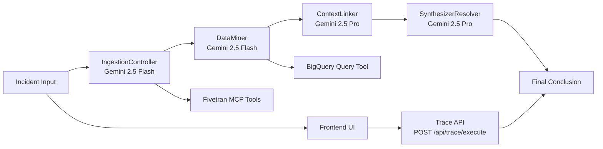
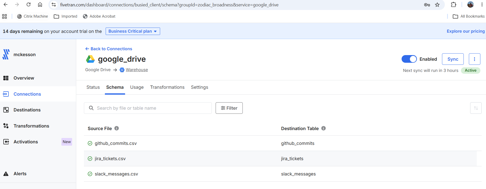
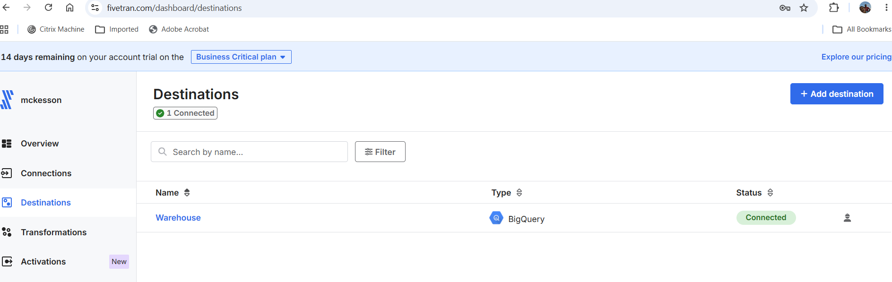
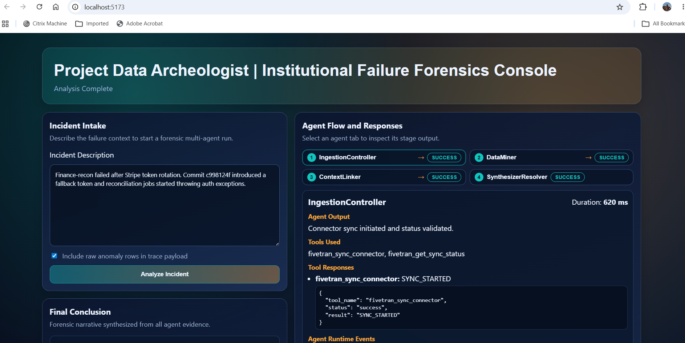
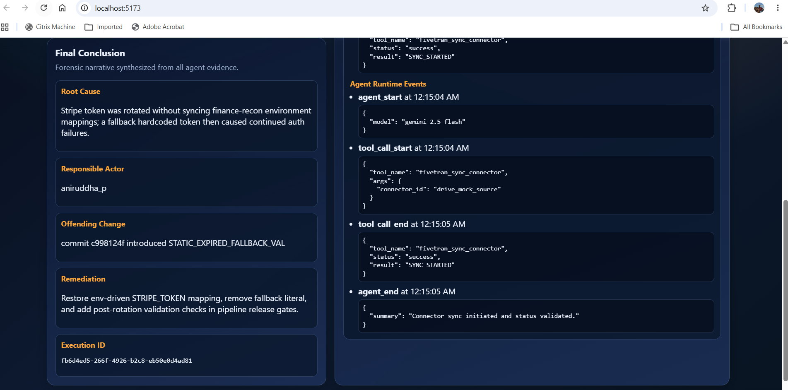

# Project Data Archeologist

> Autonomous Multi-Agent Institutional Memory Recovery Platform

Project Data Archeologist is a code-first, autonomous multi-agent platform that helps teams detect and diagnose institutional knowledge gaps and software complexity across enterprise systems.

By integrating the **Fivetran MCP Server** with the **Google Agent Development Kit (ADK) 2.0**, it transforms telemetry ingestion from a passive background routine into a dynamic, agent-directed operation.

**Use Case:** Think of the exact situation teams fear most: a critical marketing data pipeline fails during business hours, the lead architect who knew the history left last week, and a junior engineer just pushed an unchecked configuration change while trying to optimize Snowflake-to-BigQuery costs. Project Data Archeologist is built for that moment. It pulls fresh operational data, traces why the change happened, identifies who approved it, links the failure back to code and ticket history, and returns a concrete remediation path instead of a vague postmortem. It uses data from sources like Git commits, Slack Messages and Jira based operational data to investigate and provide comprehensive solution.

---

## Key Capabilities

1. **Closed-Loop Data Verification**: The agent ensures data freshness by actively calling Fivetran to trigger sync runs and verification before analysis.
2. **Deterministic Sequential Workflow**: Built on a solid Google ADK sequential model using **Gemini 2.5 Flash** (high speed, ingestion) and **Gemini 2.5 Pro** (high reasoning, causal linking/synthesis).
3. **Enterprise Storage Direct Integration**: Interacts directly with **Google BigQuery** lakehouse datasets to run analytical queries over multi-domain data silos.

---

## New Development Updates

The repository now includes additional runtime and UX layers beyond the original CLI flow:

1. **ADK Runtime Entrypoint**
- `app/agent.py` exports `root_agent` to support `adk run app`.

2. **Trace API Layer**
- `app/api/main.py` exposes API endpoints used by the UI.
- Primary endpoint: `POST /api/trace/execute`.

3. **Frontend UI**
- New UI application under `frontend/` (React + Vite + TypeScript).
- Designed to visualize incident input, agent execution trace, and final conclusion.

4. **Environment Standardization**
- Recommended Python runtime is **3.11.x**.
- Current model IDs are **`gemini-2.5-flash`** and **`gemini-2.5-pro`**.

---

## Repository Directory Structure

The codebase is structured to align with professional development guidelines and is ready for remote GitHub deployment:

```
Archeologist/
├── .gitignore               # Exclude virtual envs, temporary logs, and credential files
├── pyrightconfig.json       # Linter configuration for environment import resolution
├── README.md                # This project setup and overview guide
├── agent.md                 # Specifications and system design architecture
├── requirements.txt         # Package dependencies
├── .vscode/
│   └── settings.json        # Editor Python interpreter configurations
├── app/
│   ├── __init__.py
│   ├── agent.py             # ADK root entrypoint (exports root_agent)
│   ├── api/
│   │   ├── __init__.py
│   │   ├── main.py          # Trace API server endpoints
│   │   └── schemas.py       # API request/response models
│   ├── core.py              # Google ADK multi-agent sequential workflows
│   ├── mcp/
│   │   ├── __init__.py
│   │   └── config.json      # MCP server configuration
│   └── mock_generator.py     # High-scale multi-domain mock data seeder
├── frontend/                # React + Vite UI for incident + trace visualization
│   ├── src/
│   └── package.json
├── assets/
│   └── archaeology_diagram.png
└── tests/
    ├── __init__.py
    └── test_mcp_pipeline.py # Integration test and live evaluation suite
```

---

## Architecture

### High-Level Runtime Flow



### Static Architecture Diagram


---

## Getting Started

### 1. Prerequisites
- Python 3.11.x (recommended)
- Google Cloud Platform account with **BigQuery** API access
- Vertex AI/Google AI credentials with **Gemini** API access
- Node.js 18+ (required for `frontend/`)

### 2. Installation
Set up your virtual environment and install the required modules:

```powershell
# Create and activate virtual environment (Windows PowerShell)
python -m venv .venv
.\.venv\Scripts\Activate.ps1

# Install dependencies
python -m pip install --trusted-host pypi.org --trusted-host files.pythonhosted.org -r requirements.txt
```

If `python` is not available on PATH, create the venv using the full interpreter path:

```powershell
& "C:\Users\<your-user>\AppData\Local\Programs\Python\Python311\python.exe" -m venv .venv
```

### 3. Setup Credentials & Configuration
Define your system credentials as environment variables:

```powershell
$env:GOOGLE_APPLICATION_CREDENTIALS="path/to/your/gcp_service_account.json"
$env:GEMINI_API_KEY="your_gemini_api_key"
```

Optional: create a `.env` file at repository root. The ADK entrypoint can load `.env` values when present.

### 4. Running the Seeding Engine
Compile and output the 15,000 highly correlated telemetry logs:

```powershell
python -m app.mock_generator
```
This generates:
- `slack_messages.csv`
- `jira_tickets.csv`
- `github_commits.csv`

Upload these CSV targets into your designated Google Cloud Storage bucket or BigQuery dataset schemas to prepare for agent reasoning.

### 5. Fivetran Setup and Data Sync Flow

After generating the three mock CSV files, the following ingestion setup was completed:

1. The three mock files (`slack_messages.csv`, `jira_tickets.csv`, and `github_commits.csv`) were uploaded to Google Drive.
2. Fivetran was configured to ingest these as three separate file sources.
3. Each source was mapped and loaded into BigQuery target tables for downstream analysis.

# Source Connection:


# Destination Connection:


Pipeline integration details:

- The project uses the Fivetran MCP server configuration in `app/mcp/config.json`.
- During pipeline execution, the ingestion stage calls Fivetran sync/status tools to trigger and verify data freshness before mining and correlation.
- This ensures the agent workflow reasons over updated warehouse data instead of stale snapshots.

### 6. Running and Testing from Terminal

Run the ADK app:

```powershell
.\.venv\Scripts\Activate.ps1
adk run app
```

Run the pipeline script directly:

```powershell
.\.venv\Scripts\python.exe run_pipeline.py
```

Run tests:

```powershell
.\.venv\Scripts\Activate.ps1
pytest -v tests/test_mcp_pipeline.py
```

### 7. Running and Testing from UI

Terminal 1 (API server):

```powershell
.\.venv\Scripts\Activate.ps1
uvicorn app.api.main:api --reload --port 8000
```

Terminal 2 (frontend):

```powershell
cd frontend
npm install
npm run dev
```

Open `http://localhost:5173`.

API smoke test example:

```powershell
Invoke-RestMethod -Uri "http://127.0.0.1:8000/api/health" -Method Get
Invoke-RestMethod -Uri "http://127.0.0.1:8000/api/trace/execute" -Method Post -ContentType "application/json" -Body '{"incident_text":"Finance reconciliation failed after token rotation and fallback patch.","include_raw_data":false}'
```

## Output Display

This section embeds representative outputs from:
- `terminal_output_example.md`
- `ui_output_example.md`

### Terminal Output Example (`adk run app`)

The terminal run demonstrates full multi-agent progression from incident intake to synthesis:

```text
Running agent Project_Data_Archeologist_v2, type exit to exit.

[user]: "The finance-recon tracking system broke this morning. Update the knowledge graph and trace the bug"

[IngestionController]: Fivetran ingestion for `drive_mock_source` is complete.
[DataMiner]: Requests affected BigQuery tables and anomaly scope.
[ContextLinker]: Correlates Slack + Jira + Git and identifies timezone bug in dbt filter logic.
[SynthesizerResolver]: Produces final timeline, owner, and code patch summary.
```

Key extracted evidence from the terminal output:

- **Incident:** Missing post-midnight reconciliation rows.
- **Tables:** `payments_master`, `gateway_transactions`.
- **Ticket:** `FIN-7811`.
- **Commit:** `8a2d1e9`.
- **Root cause:** UTC/PST date comparison mismatch in downstream dbt model.
- **Fix pattern:** timezone-aware date filtering in `stg_stripe_payments.sql`.

```diff
-- models/finance/staging/stg_stripe_payments.sql
WHERE
-   DATE(created_at) = CURRENT_DATE()
+   DATE(created_at, 'America/Los_Angeles') = CURRENT_DATE('America/Los_Angeles')
```

### UI Output Example

The UI output example file captures the full incident entry plus agent-level results and final remediation:





---

## Troubleshooting Notes

1. **ADK CLI invocation issues**
- Use venv-provided CLI directly when needed:
    `.\.venv\Scripts\adk.exe run app`

2. **Windows symlink privilege error (WinError 1314)**
- Some environments block symlink creation without elevated rights or Developer Mode.
- This can affect ADK log-link creation behavior.

3. **Python version compatibility**
- Python 3.11.x is the validated runtime for this repository.
