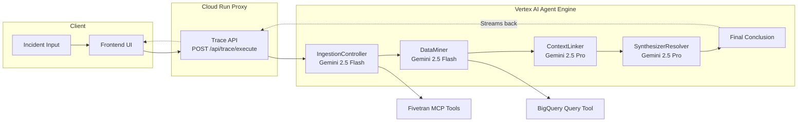
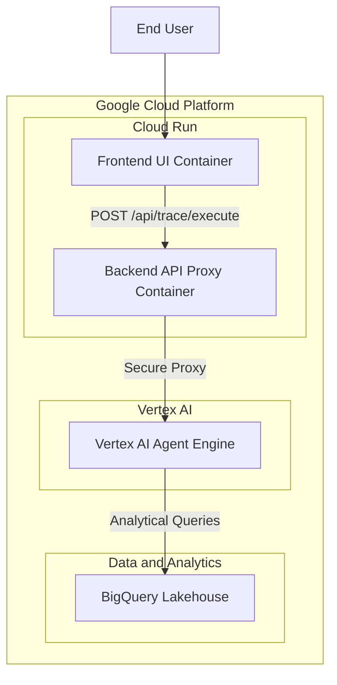

# Project Data Archeologist

> Autonomous Multi-Agent Institutional Memory Recovery Platform

Project Data Archeologist is a code-first, autonomous multi-agent platform that helps teams detect and diagnose institutional knowledge gaps and data complexity across enterprise systems as well as applicable to Community Operations.

By integrating the **Fivetran MCP Server** with the **Google Agent Development Kit (ADK) 2.0**, it transforms telemetry ingestion from a passive background routine into a dynamic, agent-directed operation.

**Illustrative Use Case:** Think of the exact situation teams fear most: a critical marketing data pipeline fails during business hours, the lead architect who knew the history left last week, and a junior engineer just pushed an unchecked configuration change while trying to optimize Snowflake-to-BigQuery costs. Project Data Archeologist is built for that moment. It pulls fresh operational data, traces why the change happened, identifies who approved it, links the failure back to code and ticket history, and returns a concrete remediation path instead of a vague postmortem. It uses data from sources like Git commits, Slack Messages and Jira based operational data to investigate and provide comprehensive solution.

### Community Use Cases (Beyond Enterprise)

1. **Public Health Coordination**: Correlates field reports, logistics updates, and team communications to quickly identify why outreach or supply workflows failed.
2. **Disaster Response and Relief**: Reconstructs fragmented timelines across volunteer channels to detect bottlenecks, reduce duplicate efforts, and speed up aid delivery.
3. **City and Civic Services**: Links citizen complaints, maintenance logs, and process changes to surface root causes behind recurring service disruptions.
4. **Schools and Universities**: Connects support tickets, communications, and policy changes to diagnose delays in student-facing services like financial aid and transport.
5. **Nonprofit Operations**: Preserves institutional memory across staff turnover by tying decisions, incidents, and fixes into one traceable operational history.

---

## Key Capabilities

1. **Fully Managed Agent Engine**: The core AI logic is hosted natively on the **Vertex AI Agent Engine**, providing enterprise-grade reliability, security, and native integrations with Google Cloud services.
2. **Deterministic Sequential Workflow**: Built on a solid Google ADK sequential model using **Gemini 2.5 Flash** (high speed, ingestion) and **Gemini 2.5 Pro** (high reasoning, causal linking/synthesis).
3. **Fivetran MCP Server Integration (Closed-Loop Data Verification)**: The agent seamlessly connects to Fivetran via the **Model Context Protocol (MCP)** to actively trigger source syncs and verify data pipeline freshness before initiating any downstream analytical querying.
4. **Enterprise Storage Direct Integration**: Interacts directly with **Google BigQuery** lakehouse datasets to run analytical queries over multi-domain data silos.
5. **Secure Real-Time Streaming UI**: Features a React-based frontend that streams live multi-agent execution traces via a secure, stateless **FastAPI Cloud Run** proxy.

---

## **Check Deployed App**

You can test the fully deployed cloud-native agent live right now:
**Live Production URL:** [https://data-archeologist-ui-234772621539.us-central1.run.app](https://data-archeologist-ui-234772621539.us-central1.run.app)

### UI Layout & Usage
- **Incident Input:** Paste your support ticket or system alert here and click "Execute Trace".
- **Execution Trace:** Watch the live multi-agent reasoning stream as it triggers Fivetran and BigQuery tools in real-time.
- **Final Conclusion:** Displays the synthesized Root Cause Analysis (RCA) and mitigation steps.

### Example Prompts to Try
Copy and paste any of these chronologically ordered incident reports into the Incident Input to see the agent automatically correlate data across Slack, Jira, and GitHub:

1. *"On 2026-01-01, user `eva_deal` reported an issue in the **Salesforce pipeline** application. They observed an ARR calculation mismatch. Can you trace issue?"*
2. *"On 2026-01-05, user `carol_ops` raised an issue impacting the **Marketing** application. The AdWords tracking pixel is failing. I need you to cross-reference this."*
3. *"On 2026-01-10, user `henry_ledger` observed an issue in the **NetSuite Finance** application. There is a NetSuite ledger variance. We need to investigate."*
4. *"On 2026-01-13, user `iris_fleet` reported a problem with the **Transportation** application. Fleet telematics are experiencing severe latency. Please verify incident."*
---

## New Development Updates

The repository has been completely overhauled from a local CLI tool into a full cloud-native production stack:

1. **Vertex AI Agent Engine Integration**
- The local agent code has been fully migrated to `agent_deploy/agent.py` and deployed directly to the **Vertex AI Agent Engine** (Google Cloud Agent Builder).

2. **Secure Backend API Proxy (Cloud Run)**
- `app/api/main.py` is now a lightweight, secure FastAPI/Starlette proxy running on **Google Cloud Run**.
- It authenticates via service accounts and proxies `POST /api/trace/execute` requests seamlessly to the Vertex AI reasoning engine.

3. **Frontend UI (Cloud Run)**
- The incident investigation interface (`frontend/`) is a React + Vite application deployed as an Nginx container on **Google Cloud Run**.
- It visualizes the entire multi-agent tool execution trace and synthesis in real-time.

4. **Environment Standardization**
- Recommended Python runtime is **3.11.x**.
- The multi-agent routing utilizes **`gemini-2.5-flash`** for rapid ingestion and **`gemini-2.5-pro`** for complex causal synthesis.

---

## Repository Directory Structure

The codebase is structured to align with professional development guidelines and is ready for remote GitHub deployment:

```
Archeologist/
├── .gitignore               # Exclude virtual envs, temporary logs, and credential files
├── README.md                # This project setup and overview guide
├── agent.md                 # Specifications and system design architecture
├── deployment.md            # Step-by-step production Cloud Run deployment guide
├── requirements.txt         # Local development dependencies
├── cloudbuild.backend.yaml  # Backend API Cloud Build configuration
├── cloudbuild.frontend.yaml # Frontend UI Cloud Build configuration
├── Dockerfile.backend       # Backend API container definition
├── Dockerfile.frontend      # Frontend UI container definition
├── nginx.conf               # Frontend Nginx routing and API proxy configuration
├── requirements.backend.txt # Lightweight Backend API dependencies
├── .env                     # Local environment variables
├── agent_deploy/            # Agent Engine deployment files
│   ├── agent.py             # ADK agent definition and monkey-patch entrypoint
│   ├── deploy_vertex.py     # Script to deploy the agent to Vertex AI
│   └── requirements.txt     # Lightweight agent dependencies for Vertex AI
├── app/
│   ├── __init__.py
│   ├── api/
│   │   ├── __init__.py
│   │   ├── main.py          # Cloud Run Trace API server endpoints
│   │   └── schemas.py       # API request/response models
│   ├── mcp/
│   │   ├── __init__.py
│   │   └── config.json      # Fivetran MCP server configuration
│   └── mock_generator.py    # High-scale multi-domain mock data seeder
├── frontend/                # React + Vite UI for incident + trace visualization
│   ├── src/
│   └── package.json
├── tests/
│   ├── test_agent_local.py  # Local ADK logic test script
│   └── test_vertex.py       # Direct Vertex AI Agent Engine testing script
└── assets/
    └── archaeology_diagram.png
```

---

## Architecture

### High-Level Runtime Flow



### Static Architecture Diagram


---

## Deployment Model

The architecture of Project Data Archeologist is split into distinct deployment layers to ensure security, scalability, and ease of management. The core reasoning engine, developed using the **Google Agent Development Kit (ADK)**, is natively deployed on the **Vertex AI Agent Engine** (part of the **Google Cloud Agent Builder** platform).

### Cloud Native Deployment Architecture



**Deployment Layers:**
1. **Frontend (Google Cloud Run):** A containerized React Single-Page Application served by Nginx. It provides the visual interface for analysts to input incident logs and view real-time agent execution traces.
2. **Backend Proxy (Google Cloud Run):** A lightweight FastAPI server acting as a secure gateway. It handles CORS, authenticates with Google Cloud using service accounts, and forwards traces to the Agent Runtime, protecting the core AI infrastructure from public access.
3. **Agent Engine (Vertex AI / Google Cloud Agent Builder):** The hosted ADK runtime. This fully managed platform executes the multi-agent reasoning loop (Ingestion, Mining, Synthesis) and natively integrates with Vertex AI LLMs (Gemini) and the BigQuery analytics backend.

---

## Getting Started

### 1. Prerequisites
- Python 3.11.x (recommended)
- Node.js 20+ (required for `frontend/` UI)
- Google Cloud Platform account with **BigQuery** and **Vertex AI Agent Engine** API access
- Google Cloud SDK (`gcloud`) installed and authenticated

### 2. Installation & Local Development Setup
While the primary deployment is cloud-native (see [`deployment.md`](deployment.md) for full GCP instructions), you can set up the environment locally for testing and development.

**Backend & Agent Environment:**
```bash
# Create and activate virtual environment (macOS/Linux)
python3 -m venv .venv
source .venv/bin/activate

# For Windows PowerShell:
# .\.venv\Scripts\Activate.ps1

# Install local development dependencies
pip install -r requirements.txt
```

**Frontend UI Environment:**
```bash
cd frontend
npm install
```

### 3. Setup Credentials & Configuration
Define your system credentials as environment variables:

```bash
export GOOGLE_APPLICATION_CREDENTIALS="path/to/your/gcp_service_account.json"
export GEMINI_API_KEY="your_gemini_api_key"
```

Optional: create a `.env` file at repository root. The ADK entrypoint can load `.env` values when present.

### 4. Running the Seeding Engine
Compile and output the 15,000 highly correlated telemetry logs:

```bash
python3 -m app.mock_generator
```
This generates:
- `slack_messages.csv`
- `jira_tickets.csv`
- `github_commits.csv`

Upload these CSV targets into your designated Google Cloud Storage bucket or BigQuery dataset schemas to prepare for agent reasoning.

### 5. Fivetran Setup and Data Sync Flow

After generating the three mock CSV files, the following ingestion setup was completed:

1. The three mock files (`slack_messages.csv`, `jira_tickets.csv`, and `github_commits.csv`) were uploaded to Google Drive.
2. Fivetran was configured to ingest these as three separate file sources.
3. Each source was mapped and loaded into BigQuery target tables for downstream analysis.

# Source Connection:


# Destination Connection:


Pipeline integration details:

- The project uses the Fivetran MCP server configuration in `app/mcp/config.json`.
- During pipeline execution, the ingestion stage calls Fivetran sync/status tools to trigger and verify data freshness before mining and correlation.
- This ensures the agent workflow reasons over updated warehouse data instead of stale snapshots.


### 6. Running and Testing from UI

Terminal 1 (API server):

```bash
source .venv/bin/activate
uvicorn app.api.main:api --reload --port 8000
```

Terminal 2 (frontend):

```bash
cd frontend
npm install
npm run dev
```

Open `http://localhost:5173`.

API smoke test example:

```bash
curl -I http://127.0.0.1:8000/api/health
curl -X POST http://127.0.0.1:8000/api/trace/execute \
  -H "Content-Type: application/json" \
  -d '{"incident_text":"Finance reconciliation failed after token rotation and fallback patch."}'
```

## Output Display

### Terminal Output Example from Terminal ADK RUN command (`adk run app`)

The terminal run demonstrates full multi-agent progression from incident intake to synthesis:

```text
(.venv) virajmac@Aniruddhas-MacBook-Pro Archeologist % adk run app
Running agent Project_Data_Archeologist_v2, type exit to exit.

[user]: On 2026-01-05, user `carol_ops` raised an issue impacting the **Marketing** application. The AdWords tracking pixel is failing. I need you to cross-reference this 

[IngestionController]: Ingestion complete. Proceeding to DataMiner with the incident description.

[DataMiner]: It appears that the issue with the AdWords tracking pixel is likely linked to recent activities by `carol_ops`.

Here's what I found:

1.  **Jira Ticket `MAR-2440`**: This ticket, titled "Optimize Marketing pipeline storage," was updated on the day of the incident, 2026-01-05. `carol_ops` is listed as the assignee. The description, "Refactoring configurations to support open cloud lakehouse schemas," suggests changes that could directly impact the Marketing application and its tracking mechanisms.

2.  **Slack Messages**: On 2026-01-04, the day before the incident, `carol_ops` sent messages in the `#mkt-campaigns` channel. These messages explicitly state: "Hey team, monitoring the AdWords tracking pixel. Needs review before the migration push." This strongly suggests that a "migration push" was underway or recently completed, and `carol_ops` was aware of potential implications for the AdWords tracking pixel.

It is highly probable that the "migration push" mentioned by `carol_ops` in Slack, potentially related to the "Refactoring configurations" in Jira ticket `MAR-2440`, is the root cause of the failing AdWords tracking pixel. The changes made during this migration, aimed at optimizing marketing pipeline storage and supporting open cloud lakehouse schemas, likely introduced a breaking change or misconfiguration for the AdWords tracking pixel.
[ContextLinker]: ### Incident Analysis Report: AdWords Tracking Pixel Failure

**Incident Date:** 2026-01-05
**Application:** Marketing
**Reporter:** `carol_ops`
**Summary:** An investigation into the failing AdWords tracking pixel reveals a strong correlation between a recent infrastructure migration and the reported outage. The key activities were led by user `carol_ops` on the day of and the day prior to the incident.

***

#### **1. Human Conversation Analysis (Slack)**

DataMiner surfaced several messages from the `#mkt-campaigns` channel providing crucial context.

*   **Timestamp:** 2026-01-04 (Day before the incident)
*   **Key Users:** `carol_ops`, `bob_growth`, `alice_mkt`
*   **Message Content:**
    > "Hey team, monitoring the AdWords tracking pixel. Needs review before the migration push."

**Analysis:**
This conversation explicitly links the "AdWords tracking pixel" to an impending "migration push." `carol_ops`, the user who later reported the issue, was a direct participant, indicating her awareness of the pixel's sensitivity and her involvement in the migration.

***

#### **2. Tracking Ticket Analysis (Jira)**

A query for relevant Jira tickets identified a series of tasks related to a marketing pipeline optimization project.

*   **Ticket ID:** `MAR-2440` (and related tickets `MAR-2433`, `MAR-2429`, etc.)
*   **Summary:** "Optimize Marketing pipeline storage"
*   **Assignee:** `carol_ops`
*   **Last Updated:** 2026-01-05 (Day of the incident)
*   **Description:**
    > "Refactoring configurations to support open cloud lakehouse schemas."

**Analysis:**
The "migration push" mentioned in Slack is almost certainly the "Refactoring configurations" project documented in this Jira ticket. The ticket was actively being worked on by `carol_ops` on the day the incident was reported. This type of configuration change to backend data pipelines is a highly plausible cause for a dependent component, like a tracking pixel, to fail.

***

#### **3. Repository Commit Analysis (GitHub)**

Queries for code commits containing relevant keywords around the incident date yielded no results.

**Analysis:**
The absence of relevant code commits in repositories like `mktg-attribution` suggests the failure was not caused by a direct change to the application's source code. This strengthens the hypothesis that the root cause lies in the configuration and infrastructure changes described in the Jira ticket, rather than a bug introduced in the codebase.

***

#### **Correlation & Conclusion**

The evidence draws a clear and direct line from project work to the resulting incident:

1.  **The Event:** A "migration push" was planned, focused on "Refactoring configurations to support open cloud lakehouse schemas" as tracked in Jira ticket `MAR-2440`.
2.  **The Key Actor:** `carol_ops` was the assignee on the Jira ticket and was discussing the migration's potential impact on the AdWords pixel in Slack.
3.  **The Timeline:**
    *   **Jan 4:** `carol_ops` discusses the sensitive tracking pixel in the context of the migration.
    *   **Jan 5:** The Jira ticket is updated, and `carol_ops` reports that the tracking pixel is failing.

It is highly probable that the **refactoring and migration effort led by `carol_ops` inadvertently broke the AdWords tracking pixel**. The failure is likely due to a misconfiguration or an unforeseen dependency issue introduced during the move to new "open cloud lakehouse schemas," not a code-level bug.
[SynthesizerResolver]: Here is the final timeline and summary of the operational failure.

### Timeline of the AdWords Tracking Pixel Failure

*   **2026-01-04:** In the `#mkt-campaigns` Slack channel, team members including `carol_ops` discuss the upcoming "migration push" and note that the AdWords tracking pixel needs to be monitored, indicating awareness of its sensitivity to the planned changes.

*   **2026-01-05:** Jira ticket `MAR-2440`, "Optimize Marketing pipeline storage," assigned to `carol_ops`, is updated. This ticket details the work being done: "Refactoring configurations to support open cloud lakehouse schemas." This configuration change is the likely cause of the failure.

*   **2026-01-05:** User `carol_ops` reports that the AdWords tracking pixel for the Marketing application is failing.

---

### Incident Summary

*   **Operational Failure:** The AdWords tracking pixel for the **Marketing** application stopped functioning.
*   **Owner:** **`carol_ops`** was the owner of the migration project that caused the incident. She was the assignee on the related Jira ticket and was involved in pre-migration discussions.
*   **Specific "Code Patch":** No code patch was responsible for the failure. The root cause was an **infrastructure configuration change** related to a data pipeline migration. This work is documented in Jira ticket **`MAR-2440`**, which describes the "Refactoring configurations to support open cloud lakehouse schemas."

```

### UI Output Example

The UI output example file captures the full incident entry plus agent-level results and final remediation:


---
## Troubleshooting Notes

1. **ADK CLI invocation issues**
- Use venv-provided CLI directly when needed:
    `.\.venv\Scripts\adk.exe run app`

2. **Python version compatibility**
- Python 3.11.x is the validated runtime for this repository.
