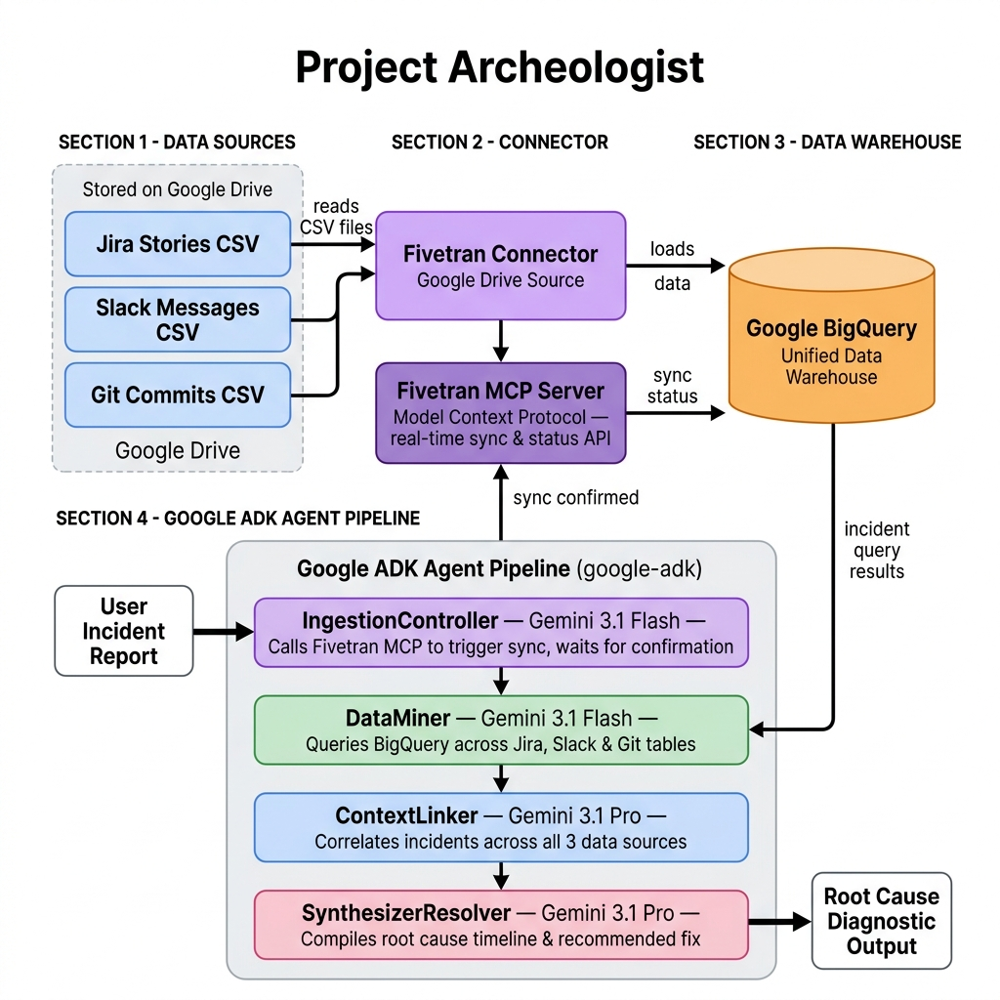

# Project Archeologist

> Autonomous Multi-Agent Institutional Memory Recovery Platform

Project Archeologist is a code-first, autonomous multi-agent platform designed to trace and diagnose **institutional memory loss** and **systemic software sprawl** across enterprise silos. 

By integrating the **Fivetran MCP Server** with the **Google Agent Development Kit (ADK) 2.0**, it transforms telemetry ingestion from a passive background routine into a dynamic, agent-directed operation.

---

## Key Capabilities

1. **Closed-Loop Data Verification**: The agent ensures data freshness by actively calling Fivetran to trigger sync runs and verification before analysis.
2. **Deterministic Sequential Workflow**: Built on a solid Google ADK sequential model using **Gemini 3.1 Flash** (high speed, ingestion) and **Gemini 3.1 Pro** (high reasoning, causal linking/synthesis).
3. **Enterprise Storage Direct Integration**: Interacts directly with **Google BigQuery** lakehouse datasets to run analytical queries over multi-domain data silos.

---

## Repository Directory Structure

The codebase is structured to align with professional development guidelines and is ready for remote GitHub deployment:

```
Archeologist/
├── .gitignore               # Exclude virtual envs, temporary logs, and credential files
├── pyrightconfig.json       # Linter configuration for environment import resolution
├── README.md                # This project setup and overview guide
├── agent.md                 # Specifications and system design architecture
├── requirements.txt         # Package dependencies
├── .vscode/
│   └── settings.json        # Editor Python interpreter configurations
├── app/
│   ├── __init__.py
│   ├── core.py              # Google ADK multi-agent sequential workflows
│   └── mock_generator.py    # High-scale multi-domain mock data seeder
└── tests/
    ├── __init__.py
    └── test_mcp_pipeline.py # Integration test and live evaluation suite
```

---

## Getting Started

### 1. Prerequisites
- Python 3.10 or higher
- Google Cloud Platform account with **BigQuery** API access
- Vertex AI/Google AI credentials with **Gemini** API access

### 2. Installation
Set up your virtual environment and install the required modules:

```bash
# Create and activate virtual environment
python3 -m venv .venv
source .venv/bin/activate

# Install dependencies
pip install -r requirements.txt
```

### 3. Setup Credentials & Configuration
Define your system credentials as environment variables:

```bash
export GOOGLE_APPLICATION_CREDENTIALS="path/to/your/gcp_service_account.json"
export GEMINI_API_KEY="your_gemini_api_key"
```

### 4. Running the Seeding Engine
Compile and output the 15,000 highly correlated telemetry logs:

```bash
python3 -m app.mock_generator
```
This generates:
- `slack_messages.csv`
- `jira_tickets.csv`
- `github_commits.csv`

Upload these CSV targets into your designated Google Cloud Storage bucket or BigQuery dataset schemas to prepare for agent reasoning.

### 5. Running the Diagnostics & Verification Suite
Launch `pytest` to execute the integration evaluation pipeline:

```bash
source .venv/bin/activate
pytest -v tests/test_mcp_pipeline.py
```

## Multi-Agent Sequential Architecture

The platform runs a sequential handoff pipeline where each agent coordinates with the next to ingest, query, correlate, and resolve system anomalies:


