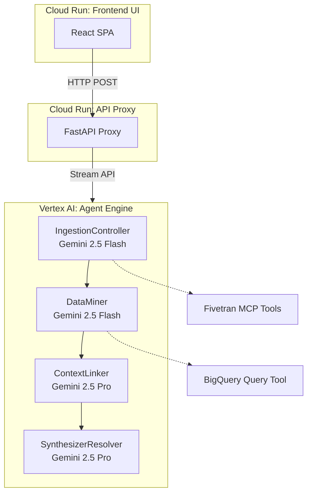

# Project Data Archeologist: Agent Spec

Project Data Archeologist is a sequential multi-agent incident analysis system built with Google ADK.

The platform accepts an incident statement, refreshes operational context, correlates telemetry across multiple data sources, creates a knowledge graph and returns a root-cause conclusion with remediation guidance.

Typical use case: a critical marketing data pipeline breaks, the architect who owned the design has left, and a junior developer pushed an unchecked configuration change while attempting a Snowflake-to-BigQuery cost optimization. The agent must rapidly reconstruct intent and impact by querying logs, correlating tickets and commits, identifying who authorized the change, and proposing the exact code-level fix.

## Current Architecture

1. IngestionController (`gemini-2.5-flash`)
- Triggers and validates ingestion sync status.

2. DataMiner (`gemini-2.5-flash`)
- Runs BigQuery-oriented anomaly discovery queries.

3. ContextLinker (`gemini-2.5-pro`)
- Correlates telemetry, tickets, and commit signals.

4. SynthesizerResolver (`gemini-2.5-pro`)
- Produces the final root-cause and remediation narrative.

## Architecture Diagram

## Detailed Execution Flow

1. **Incident Intake**
- User submits incident context through terminal (`adk run app`) or frontend UI.

2. **Ingestion Stage**
- IngestionController triggers connector refresh and verifies sync status.
- Goal: ensure analysis runs on current telemetry context.

3. **Mining Stage**
- DataMiner executes SQL-oriented extraction and anomaly correlation.
- Goal: map incident context to relevant records and commits.

4. **Linking Stage**
- ContextLinker correlates ticket activity, conversation context, and code changes.
- Goal: build a causal chain from operational symptom to engineering action.

5. **Synthesis Stage**
- SynthesizerResolver generates final human-readable report.
- Output includes root cause, responsible actor, and remediation direction.

## Runtime Entry Points

- Agent definition: `agent_deploy/agent.py` (exports `root_agent`)
- Vertex AI deployment: `agent_deploy/deploy_vertex.py`
- Local testing: `tests/test_agent_local.py`
- Trace API server proxy: `app/api/main.py`
- Frontend UI app: `frontend/`

## MCP and Config

- MCP config file: `app/mcp/config.json`
- Environment variables used:
  - `FIVETRAN_API_KEY`
  - `FIVETRAN_API_SECRET`
  - `GEMINI_API_KEY`
  - `GOOGLE_APPLICATION_CREDENTIALS`

## Trace API Contract (Current)

The trace API endpoint is used by the frontend to render execution flow:

- Endpoint: `POST /api/trace/execute`
- Health check: `GET /api/health`

Response structure includes:
- `execution_id`
- `status`
- `events` (agent/tool timeline)
- `agent_execution_summary`
- `final_conclusion`

## New UI/Trace Development (Current)

- Trace API app: `app/api/main.py`
- Trace API endpoint: `POST /api/trace/execute`
- Frontend app: `frontend/` (React + Vite + TypeScript)

UI goals for judging/demo:
- Incident input panel
- Agent flow + response trace panel
- Final conclusion panel

## Operational Notes

- Use Python 3.11.x in this repository.
- Use `gemini-2.5-flash` and `gemini-2.5-pro` model IDs.
- Preferred ADK run command: `adk run app` (or `.\.venv\Scripts\adk.exe run app`).
- On corporate networks, pip installation may require trusted-host flags.
- On Windows, ADK may encounter log symlink permission limitations (WinError 1314) in restricted environments.

